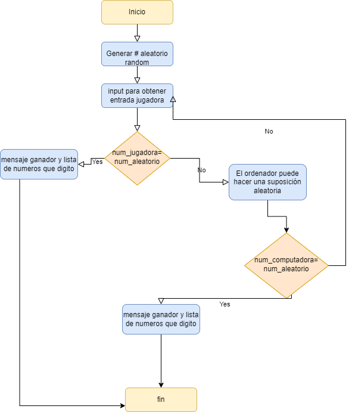
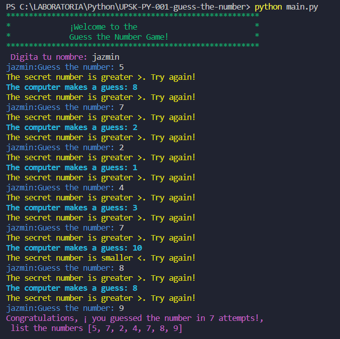
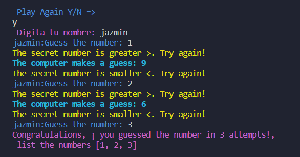
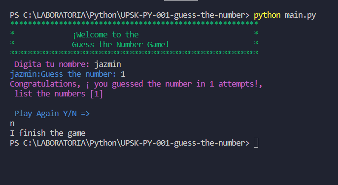
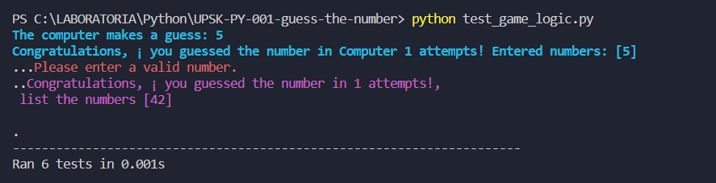

# Adivina el Número - Guess the Number

## Índice

- [1. Resumen del Proyecto](#1-resumen-del-proyecto)

## 1. Resumen del Proyecto

_Guess The Number_ es un juego interactivo que se desarrolla en el terminal,
donde la jugadora y el ordenador se turnan para intentar adivinar un número
aleatorio entre 1 y 100. Deben tener en cuenta la tentativa anterior, si fue
"muy alta" o "muy baja".

## 2. Introducion de proyecto 

Este proyecto tiene como objetivo la creación de un juego de adivinanzas de números en el que los participantes son el ordenador y un jugador. La implementación se realizará utilizando el lenguaje de programación Python, y se empleará el módulo unittest para la realización de pruebas.

El juego se desarrollará en el entorno de la terminal, ofreciendo una experiencia interactiva para el usuario. La dinámica del juego consistirá en turnos alternados entre el jugador y el ordenador, donde cada participante intentará adivinar un número secreto generado aleatoriamente entre 1 y 100.

A lo largo del juego, se proporcionará información clave después de cada intento, indicando si la suposición fue correcta o brindando pistas sobre la relación entre la suposición y el número secreto.

## 3. Implementación del Juego

- Generar un número aleatorio entre 1 y 100.
- Implementar un bucle que solicite a la jugadora adivinar el número.
- Comparar la entrada de la jugadora con el número secreto y proporcionar pistas.
- Implementar la lógica para el turno del ordenador.
- Llevar un registro de las suposiciones de la jugadora y del ordenador.
- Agregar la opción de jugar de nuevo.
- Añadir comentarios al código para mejorar la legibilidad

# 4. Diagrama de Flujo

He diseñado un diagrama de flujo detallado para proporcionar una representación visual clara de cómo se 
lleva a cabo cada proceso en nuestro proyecto. Este diagrama de flujo tiene como objetivo facilitar la comprensión 
del ciclo de vida del proyecto y la interconexión entre diferentes etapas.

# 5. Guess the Number

- Esta es la pantalla inicial que se presenta al iniciar el juego.

- Después de que un juego concluye, se da la opción de volver a jugar.
- Opciones "Y" (sí) y "N" (no) para indicar la decisión del jugador.

- Si el jugador decide no continuar, se muestra un mensaje de despedida y se termina el juego.

Estas vistas previas proporcionan una visión clara de las diferentes fases del juego, desde el inicio hasta la decisión de continuar o finalizar. Cada imagen está acompañada de elementos clave que guiarán al jugador a través de la experiencia de juego.

## 5. Testing 

Para garantizar que cada aspecto del juego funcione de manera precisa y consistente, he implementado pruebas unitarias utilizando el sólido módulo unittest de Python.

